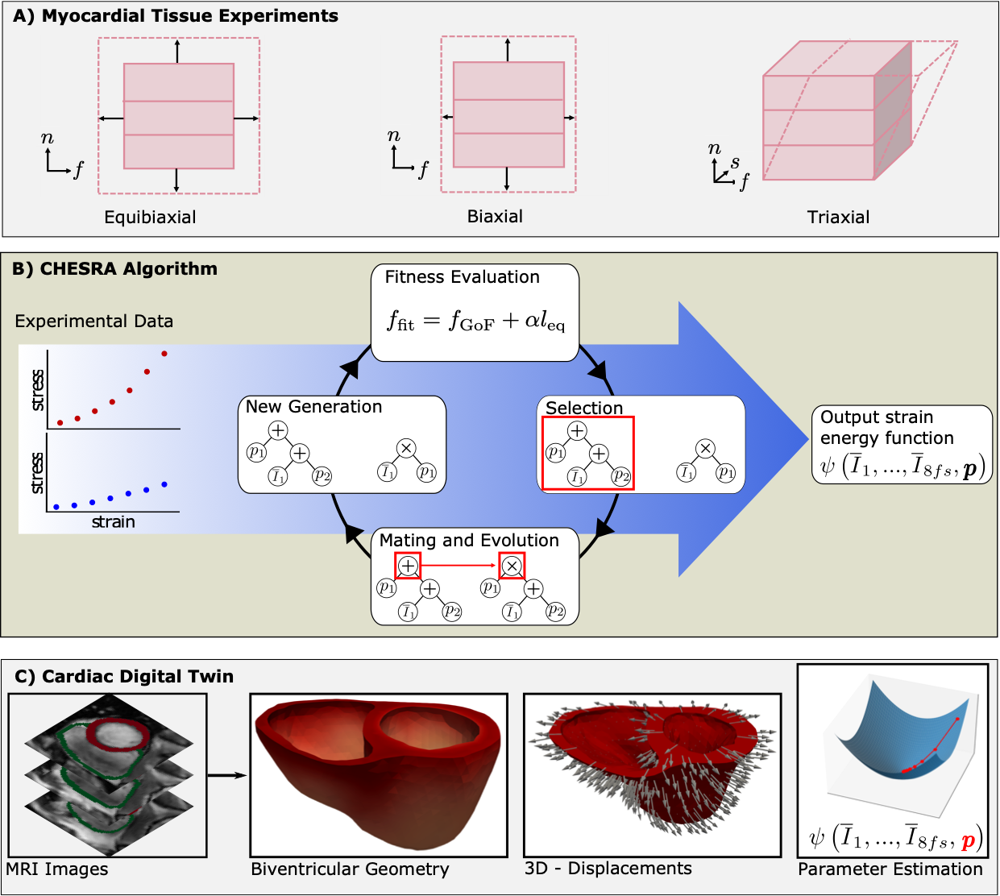

# Cardiac Hyperelastic Evolutionary Symbolic Regression Algorithm (CHESRA)

CHESRA was developed to automatically derive cardiac strain energy functions (SEFs) from experimental data. 
It is an evolutionary framework that manipulates symbolic representations of cardiac SEFs to fit experimental 
observations while minimizing SEF complexity. CHESRA takes one or more experimental 
datasets of myocardial stress-strain relations as input and evolves a population 
of SEFs according to the fitness function $f_\text{fit}$ (Fig. 1).

Fig. 1: Overview of CHESRA

## Environments

>Python = 3.10.6
> 
>deap = 1.3.3
> 
>func_timeout = 4.3.5
>
>lmfit = 1.0.3
> 
>matplotlib = 3.5.3
>
>numpy = 1.23.4
>
>pandas = 1.4.4
> 
>scipy = 1.9.3
> 
>seaborn = 0.13.2
> 
>sympy = 1.10.1
>
>dolfin = 2019.2.0.dev0
>
>yaml = 6.0.2

## Examples

We provide 3 examples: creating SEFs with CHESRA and visualizing their fits to experimental data, assessing the parameter 
variability when fitting CHESRA functions to tissue data and comparison to state-of-the art SEFs, as well as assessment 
of parameter variability in 3-D digital twins. 

0. Download repository and all required packages

2. Create SEFs with CHESRA

>`cd Experiments/Fig4_CHESRAFunctions`
> 
>`python ./run_exp.py`
> 
> `python ./create_figure.py`
> 
**Note:** use the default options to reproduce the results in the paper. Otherwise, all parameters can be adjusted. See

>`python ./run_exp.py --help`

2. Assess parameter variability when fitting to tissue data
>`cd Experiments/Fig5_InverseTest`
> 
>`python ./run_exp.py`
> 
> `python ./create_figure.py`